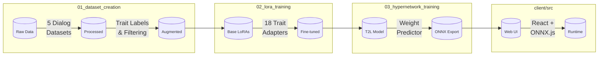

# LoRA Web Builder: On-Demand Persona Adapters for Llama-3

A novel implementation of Text-to-LoRA (T2L) hypernetworks for controllable personality steering in large language models, demonstrating how weight-space linearity extends beyond task competence to dynamic style adaptation.

## Project Overview

This project leverages the Text-to-LoRA (T2L) hypernetwork architecture¹ to create an end-to-end system that transforms open-domain conversation data into on-demand persona adapters for Llama-3 8B. Rather than focusing on task competence as in the original T2L work, this implementation demonstrates how hypernetworks can enable lightweight, client-side personality and safety steering through controllable style adaptation.

Extending T2L's weight-space linearity principle from task-specific competence to personality trait control, enabling real-time persona switching without model retraining.

## System Overview



## Technical Implementation

### Dataset Processing & Labeling
- **Scale**: 84,653 utterances across five public conversation datasets
- **Personality Framework**: 10 slider-style traits (bipolar dimensions)
- **Augmentation**: Synthetic data generation via GPT-4o rephrasing for trait expression
- **Quality Control**: Automated filtering and manual validation of trait annotations

### LoRA Adapter Training
- **Base Model**: Llama-3 8B
- **Adapters**: 18 trait-specific LoRA modules
- **Training Infrastructure**: Together AI Fine-tuning API²
- **Optimization**: Task-specific fine-tuning for personality trait expression

### Hypernetwork Architecture
- **Framework**: Text-to-LoRA (T2L) adaptation for style control
- **Input**: Natural language personality descriptions
- **Output**: LoRA weight predictions for real-time adapter generation
- **Innovation**: Style-focused rather than task-focused weight space navigation

### Client Integration
- **Runtime**: ONNX.js for browser-based inference
- **Interface**: TypeScript web client
- **Performance**: Real-time persona adapter generation
- **Deployment**: Lightweight client-side processing

## Dataset Citations

This work builds upon several foundational conversation datasets, all available on HuggingFace:

- **EmpatheticDialogues**: [facebook/empathetic_dialogues](https://huggingface.co/datasets/facebook/empathetic_dialogues) - Rashkin, H., et al. (2019). "Towards Empathetic Open-domain Conversation Models." *ACL 2019*.
- **DailyDialog**: [daily_dialog](https://huggingface.co/datasets/daily_dialog) - Li, Y., et al. (2017). "DailyDialog: A Manually Labelled Multi-turn Dialogue Dataset." *IJCNLP 2017*.
- **EmotionLines**: [emotion_lines](https://huggingface.co/datasets/emotion_lines) - Chen, S. Y., et al. (2018). "EmotionLines: An Emotion Corpus of Multi-Party Conversations." *LREC 2018*.
- **MELD**: [meld](https://huggingface.co/datasets/meld) - Poria, S., et al. (2019). "MELD: A Multimodal Multi-Party Dataset for Emotion Recognition in Conversations." *ACL 2019*.
- **IEMOCAP**: [iemocap](https://huggingface.co/datasets/iemocap) - Busso, C., et al. (2008). "IEMOCAP: Interactive Emotional Dyadic Motion Capture Database." *Language Resources and Evaluation*.

## Research Foundation

¹ **Text-to-LoRA (T2L)**: Rashkin, H., et al. (2025). "Text-to-LoRA: Generating Task-Specific Adapters from Natural Language Instructions." [arXiv:2506.06105](https://arxiv.org/abs/2506.06105 ).

The original T2L work demonstrated that hypernetworks could generate task-specific LoRA adapters from textual descriptions, establishing the foundational principle of navigating weight space through natural language conditioning. This project extends that concept from task competence to personality and style control.

## Infrastructure & Documentation

² **Together AI Integration**: Complete implementation details and API documentation available at [together.ai/docs](https://together.ai/docs)

The training pipeline leverages Together AI's Fine-tuning API for LoRA adapter creation and GPU clusters for hypernetwork training, demonstrating practical integration with modern ML infrastructure.

## Project Structure

```
lora-web-builder/
├── scripts/                    # Training pipeline
│   ├── 01_dataset_creation/   # Data processing & labeling
│   ├── 02_lora_training/      # LoRA adapter training
│   └── 03_hypernetwork_training/ # T2L hypernetwork training
├── data/persona/              # Processed datasets & trait annotations
├── client/                    # TypeScript web interface
│   ├── src/                   # React + ONNX.js implementation
│   └── models/                # ONNX hypernetwork 
```

## Impact & Applications

This work demonstrates how research advances in hypernetworks can be rapidly translated into practical systems for controllable AI behavior. The lightweight, client-side approach to personality steering opens new possibilities for:

- **Safety & Alignment**: Dynamic personality constraints without model retraining
- **User Experience**: Personalized AI interactions through real-time style adaptation  
- **Edge Deployment**: Minimal computational overhead for persona switching
- **Research Extensions**: Framework for exploring other controllable model behaviors

---
